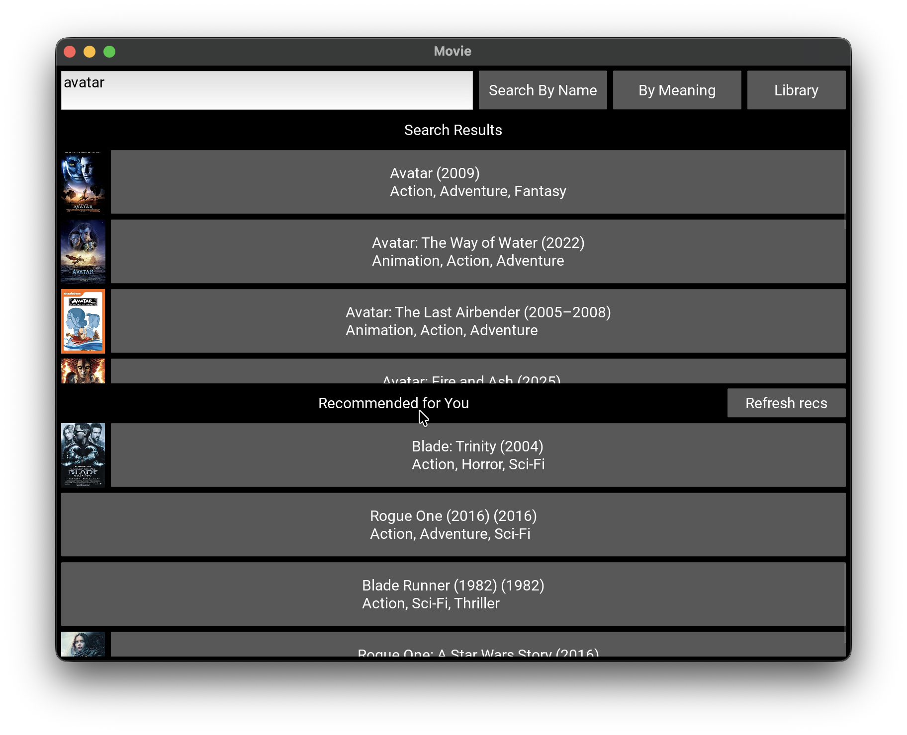

# 🎬 Movie Recommender App

Простое десктопное приложение (с возможностью комплияции под мобильные устройства) на Python с использованием Kivy для поиска фильмов, хранения личной библиотеки и получения рекомендаций на основе предпочтений пользователя.

Приложение использует методы обработки естественного языка (NLP) и векторные представления (embeddings) для реализации semantic search и рекомендаций.



---

## 📦 Технологии
- Python 3.13  
- Kivy (UI)  
- NumPy  
- Pandas  
- Scikit-learn  
- SentenceTransformers (all-MiniLM-L6-v2) 

---

## 🚀 Возможности

- 🔍 Поиск фильмов через API OMDb
- 🧠 Семантический поиск с использованием эмбеддингов
- ⭐ Персонализированные рекомендации
- 📚 Библиотека пользователя с рейтингами
- ⚡ Кэшированные эмбеддинги для быстрого вывода результатов

---

### 🧠 Поиск по смыслу (Semantic Search)
- Ввод произвольного описания (например: *"dark sci-fi about space and AI"*)
- Преобразование текста в embedding  
- Поиск похожих фильмов через cosine similarity  
- Работает локально после кэширования

---

### ⭐ Персональные рекомендации

Система рекомендаций построена на content-based подходе с embeddings.

#### Как это работает:
1. Каждый фильм -> embedding (вектор)  
2. Пользователь -> средний embedding понравившихся фильмов  
3. Сравнение через cosine similarity  
4. Возврат наиболее похожих фильмов  

#### Учитывается:
- оценки пользователя 
- сохраненные фильмы (исключаются из выдачи) 

---

### 📚 Библиотека пользователя
- Сохранение фильмов  
- Хранение в локальном JSON  
- Отображение:
  - постера  
  - жанра  
  - оценки  
  - описания  

---

### 📝 Оценки
- Рейтинг от 0 до 5  
- Используется для построения пользовательского профиля  
- Влияет на рекомендации 

### ⚡ Оптимизация
- Кэширование фильмов (`movies.json`)  
- Кэширование embeddings (`embeddings.npy`)  
- Повторные запуски не требуют пересчета модели

---

## 🖥️ Интерфейс

Приложение состоит из 3 экранов:

### 1. Search Screen
- Единая строка ввода  
- Поиск по названию  
- Поиск по смыслу  
- Результаты поиска  
- Рекомендации   

### 2. Details Screen
- Полная информация о фильме  
- Постер  
- Добавление в библиотеку  
- Выставление рейтинга  

### 3. Library Screen
- Список сохранённых фильмов  
- Карточки с постерами  
- Отображение рейтингов

---

## 🏗️ Архитектура проекта
```
Movie-recommender/
│
├── app/
│ ├── recommender.py
│ ├── embedding_model.py
│ ├── embegging_store.py
│ ├── omdb_api.py
│ ├── user_profile.py
│ ├── cache.py
│ └── config.py
│
├── ui/
│ ├── main.py
│ ├── ui.kv
│ ├── search_screen.py
│ ├── details_screen.py
│ ├── library_screen.py
│ └── images/
│   └── no_poster.jpg
│
├── scripts
│ ├── parse_kaggle_dataset.py
│ └── search_local.py
|
└── data/
    ├── user.json
    ├── embeddings.npy
    └── movies.json
```

---

## ⚙️ Установка и запуск

Клонирование и установка проекта:
```bash
git clone <repo>
cd Movie-recommender

python3 -m venv venv
source venv/bin/activate

pip install -r requirements.txt
```

Создайте .env файл:
```
OMDB_API_KEY=your_api_key
```
Очистите пользовательскую библиотеку фильмов (замените файл `user.json` на пустой):
```bash
{
  "user_id": 1,
  "ratings": {

  },
  "library": [

  ]
}
```

Запуск приложения:
```
python3 -m ui.main
```

## ⚠️ Известные недочеты

- Некоторые постеры могут быть недоступны (OMDb 404)  
- Первый запуск может быть медленным (из-за загрузки модели)  
